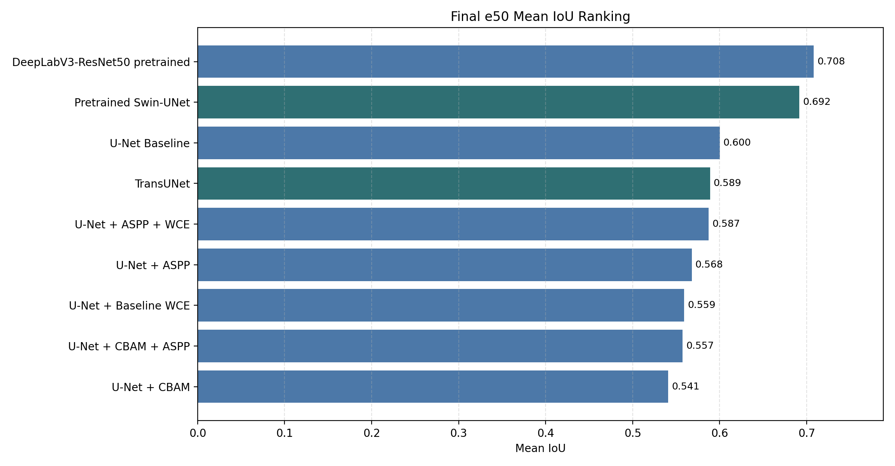
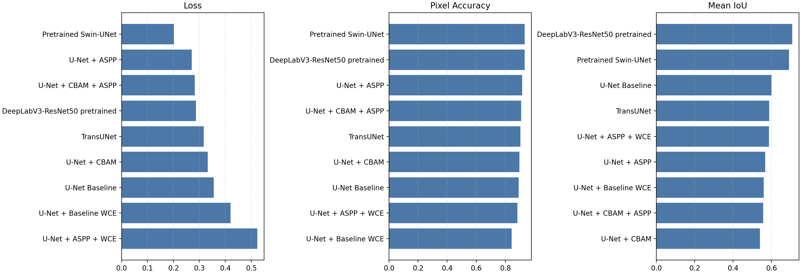
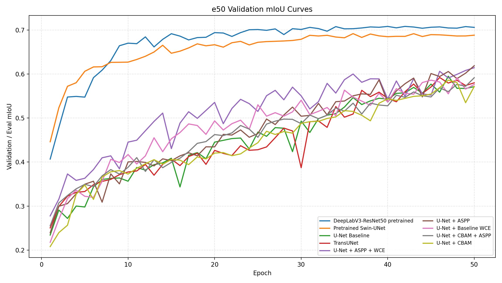
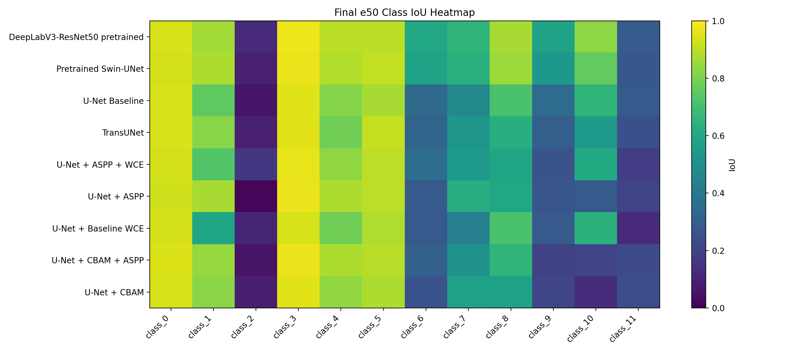

# CNN 语义分割实验报告

项目路径：`D:\uav_segmentation_project`  
报告范围：CNN / U-Net 系列、DeepLabV3-ResNet50、TransUNet 与 Pretrained Swin-UNet 实验  
报告日期：2026-06-06  
说明：本报告已纳入第四阶段 CNN + Transformer 融合模型 TransUNet，并补充了 ImageNet 预训练 Swin-T encoder 的 Transformer 分割实验；组员完成的独立 Transformer 第三阶段结果可在最终总表中继续合并。

## 1. 实验目的

本阶段实验围绕无人机 / CamVid-style 道路场景语义分割任务，评估多种 CNN 分割模型及模块改进策略。主要目标如下：

1. 建立修复数据增强逻辑后的 U-Net 基准模型。
2. 验证 CBAM 注意力模块是否能提升 U-Net 的分割性能。
3. 验证 ASPP 多尺度上下文模块是否能提升 U-Net 的分割性能。
4. 验证类别加权交叉熵（Weighted Cross Entropy, WCE）对类别不平衡问题是否有效。
5. 将从零训练的 U-Net 系列模型与预训练 DeepLabV3-ResNet50 强基线进行对比。
6. 采用带 epoch 后缀的实验命名方式，避免 30 轮与 50 轮结果互相覆盖。
7. 完成第四阶段 TransUNet 融合建模实验，评估 CNN 局部建模与 Transformer 全局建模的互补效果。
8. 补充预训练 Transformer 路线，验证预训练 Swin-T encoder 对小样本语义分割的收益。

## 2. 数据集与划分方式

本项目数据位于 `data/raw` 目录下，当前数据规模如下：

| 数据目录 | 图像数量 | 标签数量 | 用途 |
|---|---:|---:|---|
| `data/raw/train` | 367 | 367 | 训练数据来源 |
| `data/raw/test` | 101 | 101 | U-Net 系列最终测试集 / DeepLab 当前评估集 |

不同模型采用了两种数据划分策略：

| 模型类别 | 训练数据 | 验证 / 选取最优权重 | 最终评估 |
|---|---|---|---|
| U-Net 系列 | `data/raw/train` 内部 80%，约 294 张 | `data/raw/train` 内部 20%，约 73 张 | `data/raw/test`，101 张 |
| DeepLabV3-ResNet50 | `data/raw/train` 全部 367 张 | `data/raw/test`，101 张 | 同当前评估集 |

需要注意的是，DeepLabV3 当前使用 `data/raw/test` 作为 current eval split，用于模型选择与评估。因此在正式表述中应称为“当前本地评估结果”，不应在未确认官方 held-out test split 的情况下直接称为正式 CamVid benchmark 测试结果。

## 3. 实验设置

### 3.1 通用训练配置

| 配置项 | 取值 |
|---|---|
| 输入尺寸 | `360 x 480` |
| 类别数 | 12 |
| Batch size | 2 |
| U-Net base channels | 32 |
| 主实验训练轮数 | 50 epochs |
| 最优模型保存依据 | 验证集 / 当前评估集 mIoU |
| 输出命名方式 | `experiment_name_e{num_epochs}` |

最终 50 轮实验均使用 `_e50` 后缀保存，例如：

```text
outputs/checkpoints/unet_baseline_augfix_e50_best.pth
outputs/logs/unet_baseline_augfix_e50_train_log.txt
outputs/metrics/unet_baseline_augfix_e50_test_results.txt
```

这种命名方式可以避免 30 轮和 50 轮实验互相覆盖，便于后续复现实验与撰写报告。

### 3.2 数据增强与训练逻辑修复

早期版本中，训练集与验证集共用同一个 Dataset 对象，导致关闭验证集增强时可能同时影响训练集增强。后续已修复为：训练集与验证集分别构造独立 Dataset，再进行 Subset 划分。

修复后的 U-Net 系列训练流程如下：

```text
data/raw/train
-> 按固定随机种子进行 80/20 划分
-> 训练集开启增强
-> 验证集关闭增强
-> 按验证 mIoU 保存 best checkpoint
-> 在 data/raw/test 上测试
```

DeepLabV3 训练流程如下：

```text
data/raw/train 全部用于训练
-> data/raw/test 用作 current eval split
-> 按 eval mIoU 保存 best checkpoint
```

DeepLabV3 训练中还启用了 `drop_last=True`，用于避免最后一个 batch 只剩 1 张图片时，ASPP pooling 分支中的 BatchNorm 出现如下错误：

```text
Expected more than 1 value per channel when training
```

## 4. 模型与实验设计

本阶段共完成以下模型实验：

| 实验名称 | 脚本 | 目的 |
|---|---|---|
| U-Net Baseline | `train.py` | 从零训练的基础 CNN 分割模型 |
| U-Net + CBAM | `train_cbam.py` | 验证注意力模块 CBAM 的作用 |
| U-Net + ASPP | `train_aspp_fixed_aug.py` | 验证多尺度上下文模块 ASPP 的作用 |
| U-Net + CBAM + ASPP | `train_cbam_aspp.py` | 验证 CBAM 与 ASPP 组合是否有效 |
| U-Net Baseline + WCE | `train_baseline_wce.py` | 验证类别加权 CE 对 baseline 是否有效 |
| U-Net + ASPP + WCE | `train_aspp_weighted_ce.py` | 验证 WCE 对 ASPP 版本是否有效 |
| DeepLabV3-ResNet50 | `train_deeplab.py` | 预训练强 CNN 基线 |
| TransUNet | `train_transunet.py` | 第四阶段 CNN + Transformer 融合建模 |
| Pretrained Swin-UNet | `train_swin_unet.py` | 验证 ImageNet 预训练 Swin-T Transformer encoder |

其中，U-Net 系列主要用于结构消融与损失函数消融；DeepLabV3-ResNet50 用于评估预训练 CNN 模型在小样本语义分割场景下的收益；TransUNet 用于验证局部卷积特征与全局自注意力建模的互补性；Pretrained Swin-UNet 用于验证预训练 Transformer encoder 是否能弥补从零训练 Transformer 的数据不足问题。

## 5. 50 轮最终实验结果

下表汇总了当前 50 轮实验的最终测试 / 评估结果。指标来源于：

```text
outputs/metrics/*_e50_*results.txt
```

| 排名 | 模型 | 输出前缀 | Loss | Pixel Acc | Mean IoU |
|---:|---|---|---:|---:|---:|
| 1 | DeepLabV3-ResNet50 pretrained | `deeplabv3_resnet50_pretrained_road_e50` | 0.287043 | 0.931919 | **0.708121** |
| 2 | Pretrained Swin-UNet | `swin_unet_pretrained_e50` | 0.201861 | 0.933063 | **0.691668** |
| 3 | U-Net Baseline | `unet_baseline_augfix_e50` | 0.355128 | 0.892028 | 0.600185 |
| 4 | TransUNet | `transunet_e50` | 0.316690 | 0.902656 | 0.588982 |
| 5 | U-Net + ASPP + WCE | `unet_aspp_weighted_ce_e50` | 0.523465 | 0.882595 | 0.587356 |
| 6 | U-Net + ASPP | `unet_aspp_fixed_aug_e50` | 0.270272 | 0.915694 | 0.568018 |
| 7 | U-Net Baseline + WCE | `unet_baseline_wce_e50` | 0.420052 | 0.842551 | 0.559326 |
| 8 | U-Net + CBAM + ASPP | `unet_cbam_aspp_augfix_e50` | 0.281705 | 0.908615 | 0.557352 |
| 9 | U-Net + CBAM | `unet_cbam_augfix_e50` | 0.331968 | 0.896127 | 0.540934 |





## 6. 训练过程分析

从 50 轮验证 / 评估 mIoU 曲线可以看到，U-Net 系列模型在 30 轮后仍有继续提升趋势。因此，30 轮实验适合作为快速筛选结果，但 50 轮实验更适合作为最终 CNN 消融对比依据。



当前报告主线只保留 50 轮正式实验结果，所有模型对比均基于对应的 best checkpoint 和测试集评估结果。

第四阶段 TransUNet 训练 50 轮后，最佳验证集 mIoU 出现在 epoch 46，为 `0.592059`；最终使用该 best checkpoint 在 `data/raw/test` 上评估，Mean IoU 为 `0.588982`。

补充的 Pretrained Swin-UNet 使用 ImageNet 预训练 Swin-T encoder，50 轮最佳 mIoU 出现在 epoch 36，为 `0.691668`。相比从零训练 TransUNet 的 `0.588982`，提升约 `10.27` 个 mIoU 百分点，说明预训练 Transformer 表征对当前小样本任务有明显收益。

## 7. 逐类 IoU 分析

逐类 IoU 热力图如下：



从逐类结果可以观察到：

- DeepLabV3 整体最稳定，多数类别 IoU 高于其他模型。
- Pretrained Swin-UNet 在 class_1、class_8、class_9、class_10 等类别上明显优于从零训练 TransUNet，是当前最强 Transformer 路线。
- U-Net Baseline 是从零训练 U-Net 系列中整体 mIoU 最高的模型。
- TransUNet 在 class_1、class_5、class_7 等类别上表现稳定，整体 mIoU 高于 ASPP/WCE 版本，但仍低于 U-Net Baseline。
- ASPP 版本具有较高 Pixel Accuracy，但 Mean IoU 未超过 Baseline。
- CBAM 单独使用时表现最低，说明当前配置下注意力模块未带来稳定收益。
- CBAM + ASPP 未产生正向叠加效果。
- Weighted CE 对 ASPP 有一定帮助，但对 Baseline 不利。

## 8. 消融实验结论

### 8.1 CBAM 模块

U-Net + CBAM 的 mIoU 为 `0.540934`，低于 U-Net Baseline 的 `0.600185`。这说明在当前数据规模与训练配置下，CBAM 并未提升模型泛化能力。

可能原因包括：

- 数据量较小，注意力模块增加参数后更容易引入训练不稳定。
- 当前类别分布和场景结构下，CBAM 对关键小类的增强不足。
- 50 轮训练中，CBAM 未能弥补其额外复杂度带来的泛化压力。

### 8.2 ASPP 模块

U-Net + ASPP 的 mIoU 为 `0.568018`，高于 CBAM，但仍低于 Baseline。说明多尺度上下文模块并未在当前 U-Net 结构中稳定提升整体 mIoU。

不过，ASPP 版本 Pixel Accuracy 达到 `0.915694`，高于 Baseline 的 `0.892028`。这说明 ASPP 可能改善了大面积类别的像素分类，但对小类或困难类别的 IoU 改善不足，最终导致 Mean IoU 未超过 Baseline。

### 8.3 CBAM + ASPP 组合

U-Net + CBAM + ASPP 的 mIoU 为 `0.557352`，低于 Baseline，也低于单独 ASPP + WCE。说明两种模块组合后没有形成协同提升。

该结果表明，在当前任务中，简单叠加注意力模块和多尺度模块并不一定能带来更好的泛化表现。

### 8.4 Weighted Cross Entropy

Weighted CE 的影响具有差异性：

| 对比 | 不使用 WCE | 使用 WCE | 变化 |
|---|---:|---:|---:|
| Baseline -> Baseline + WCE | 0.600185 | 0.559326 | 下降 |
| ASPP -> ASPP + WCE | 0.568018 | 0.587356 | 提升 |

这说明 WCE 并不是稳定有效的默认损失函数。它可以帮助 ASPP 版本提升部分小类表现，但会降低 Baseline 的整体效果。

### 8.5 DeepLabV3-ResNet50 预训练模型

DeepLabV3-ResNet50 的 mIoU 达到 `0.708121`，比最佳从零训练 U-Net 系列模型高：

```text
0.708121 - 0.600185 = 0.107936
```

即提升约 `10.79` 个 mIoU 百分点。

这说明在当前小规模 UAV / CamVid-style 语义分割任务中，预训练特征比单纯增加 U-Net 局部模块更关键。

### 8.6 TransUNet 融合模型

TransUNet 的测试集 mIoU 为 `0.588982`，高于 U-Net + ASPP + WCE 的 `0.587356`，但低于 U-Net Baseline 的 `0.600185`。其验证集最佳 mIoU 为 `0.592059`，说明 Transformer bottleneck 能带来一定全局上下文收益，但在当前数据规模和从零训练设置下，收益不足以超过更简单的 U-Net Baseline。

逐类结果中，TransUNet 对 class_1、class_5、class_7 保持较好 IoU，但 class_2、class_11 等小类仍明显偏低。这说明融合建模可以作为第四阶段对比模型，但当前项目最终推荐仍应优先选择 DeepLabV3 或 U-Net Baseline。

### 8.7 Pretrained Swin-UNet

Pretrained Swin-UNet 的测试集 mIoU 为 `0.691668`，Pixel Accuracy 为 `0.933063`，显著高于从零训练 TransUNet 的 `0.588982`，也明显高于 U-Net Baseline 的 `0.600185`。该结果说明此前 TransUNet 表现不佳的主要原因不是 Transformer 思路本身无效，而是小样本条件下从零训练 Transformer 难以学到稳定泛化特征。

逐类结果中，Pretrained Swin-UNet 在 class_8、class_9、class_10 上分别达到 `0.855118`、`0.531460`、`0.759433`，相较 TransUNet 的 `0.625558`、`0.303899`、`0.542435` 有明显提升。不过它仍略低于 DeepLabV3-ResNet50 的 `0.708121`，说明在当前设置下，预训练 CNN 强基线仍保持整体优势。

## 9. 总体结论

本阶段 CNN 与融合建模实验可以总结为：

1. **DeepLabV3-ResNet50 是当前最优模型**，mIoU 为 `70.81%`。
2. **Pretrained Swin-UNet 是当前最强 Transformer 路线**，mIoU 为 `69.17%`。
3. 在从零训练的 U-Net 系列中，**U-Net Baseline 最优**，mIoU 为 `60.02%`。
4. 第四阶段 **TransUNet** mIoU 为 `58.90%`，略高于 ASPP/WCE，但未超过 U-Net Baseline。
5. CBAM、ASPP、CBAM + ASPP 均未超过 Baseline。
6. 当前结果表明，小样本语义分割中，预训练表征是决定性能的关键因素；预训练 Transformer 明显优于从零训练 Transformer。

## 10. 可用于论文 / 报告的表述

可以在论文或阶段性报告中使用如下表述：

> 在统一 50 epoch 训练设置下，U-Net Baseline 在本地测试集上取得 60.02% mIoU。进一步引入 CBAM、ASPP、类别加权损失以及从零训练 TransUNet 后，整体 mIoU 均未超过 Baseline，其中 TransUNet 达到 58.90% mIoU。补充 ImageNet 预训练 Swin-T encoder 后，Pretrained Swin-UNet 的 mIoU 提升至 69.17%，显著高于从零训练 TransUNet，说明 Transformer 路线需要预训练表征支撑。当前最优模型仍为预训练 DeepLabV3-ResNet50，mIoU 为 70.81%。

## 11. 当前产物索引

最终汇总表：

```text
outputs/metrics/cnn_e50_summary.csv
outputs/metrics/cnn_e50_class_iou.csv
outputs/metrics/transunet_e50_test_results.{txt,csv}
outputs/metrics/swin_unet_pretrained_e50_test_results.{txt,csv}
```

报告图像：

```text
outputs/figures/cnn_report/final_e50_miou_ranking.png
outputs/figures/cnn_report/final_e50_metric_comparison.png
outputs/figures/cnn_report/e50_val_miou_curves.png
outputs/figures/cnn_report/final_e50_class_iou_heatmap.png
```

主要模型与日志：

```text
outputs/checkpoints/*_e50_best.pth
outputs/checkpoints/transunet_e50_best.pth
outputs/checkpoints/swin_unet_pretrained_e50_best.pth
outputs/logs/*_e50_train_log.txt
outputs/logs/transunet_e50_train_log.txt
outputs/logs/swin_unet_pretrained_e50_train_log.txt
outputs/metrics/*_e50_*results.txt
outputs/predictions/transunet_e50/
outputs/predictions/swin_unet_pretrained_e50/
```

## 12. 后续工作

CNN、第四阶段 TransUNet 与 Pretrained Swin-UNet 可以暂时收口。后续建议：

1. 将组员第三阶段 Transformer 结果合并进同一张最终对比表。
2. 在最终论文中统一说明 DeepLab 当前使用 `data/raw/test` 作为 current eval split。
3. 从 `outputs/predictions/transunet_e50/compare` 与 `outputs/predictions/swin_unet_pretrained_e50/compare` 选择典型样本，用于说明从零训练 Transformer 与预训练 Transformer 的差异。
